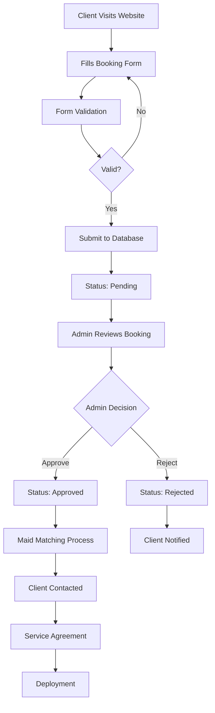

# 📋 Royal Maids Hub - Booking System & Reports Documentation

**Version:** 2.0  
**Last Updated:** October 24, 2025  
**Documentation Type:** Complete Booking System & Reporting Logic  

---

## 📑 Table of Contents

1. [Booking System Overview](#booking-system-overview)
2. [Booking Workflow](#booking-workflow)
3. [Booking Form Fields](#booking-form-fields)
4. [Database Structure](#database-structure)
5. [Booking Management](#booking-management)
6. [Reports System](#reports-system)
7. [KPI Dashboard](#kpi-dashboard)
8. [Report Types](#report-types)
9. [Data Analysis Logic](#data-analysis-logic)
10. [Export Functionality](#export-functionality)

---

## 🎯 Booking System Overview

### What is the Booking System?

The Royal Maids Hub **Booking System** is a comprehensive multi-step form that collects detailed information from clients to match them with the perfect domestic worker. The system captures over **40 data points** across 4 major categories.

### System Architecture

```
Client Form (booking.php)
    ↓
Multi-Step Form (4 Sections)
    ↓
Form Validation (JavaScript + PHP)
    ↓
Data Processing (PHP Backend)
    ↓
Database Storage (bookings table)
    ↓
Admin Management (bookings.php)
    ↓
Status Workflow (pending → approved/rejected)
    ↓
Maid Matching & Deployment
```

### Key Features

✅ **Multi-step form** with progress tracking  
✅ **Real-time validation** for required fields  
✅ **File upload** for ID documents  
✅ **Responsive design** with Tailwind CSS  
✅ **Status management** (pending, approved, rejected)  
✅ **Advanced filtering** and search  
✅ **Detailed view** for each booking  
✅ **Activity logging** for audit trail  
✅ **PDF export** capability (planned)  

---

## 🔄 Booking Workflow

### Complete Booking Lifecycle



### Step-by-Step Process

#### **Step 1: Client Form Submission**

**Location:** `booking.php` (Public-facing)

**Process:**
1. Client accesses the booking form
2. Completes 4-section multi-step form
3. Uploads National ID/Passport (optional)
4. Submits form data

**Technical Implementation:**
```php
if ($_SERVER['REQUEST_METHOD'] === 'POST') {
    // Database connection
    $conn = new mysqli(DB_HOST, DB_USER, DB_PASS, DB_NAME);
    
    // Collect and sanitize form data
    $full_name = $conn->real_escape_string($_POST['full-name'] ?? '');
    $phone = $conn->real_escape_string($_POST['phone'] ?? '');
    // ... (40+ fields)
    
    // Handle file upload
    $national_id_path = '';
    if (isset($_FILES['national-id']) && $_FILES['national-id']['error'] === UPLOAD_ERR_OK) {
        // Upload logic
    }
    
    // Insert into database
    $sql = "INSERT INTO bookings (...) VALUES (...)";
    if ($conn->query($sql) === TRUE) {
        // Show success message
    }
}
```

#### **Step 2: Database Storage**

**Table:** `bookings`  
**Initial Status:** `pending`  
**Timestamp:** Auto-generated `created_at`

#### **Step 3: Admin Review**

**Location:** `static/bookings.php` (Admin dashboard)

**Admin Capabilities:**
- View all bookings
- Filter by status
- Search by name/email/phone
- View detailed information
- Update booking status
- Delete bookings
- Contact clients

#### **Step 4: Status Management**

**Available Statuses:**
- **Pending**: Awaiting admin review
- **Approved**: Admin approved, ready for matching
- **Rejected**: Request denied

**Status Update Process:**
```php
if (isset($_POST['action']) && $_POST['action'] === 'update_status') {
    $bookingId = $_POST['booking_id'] ?? 0;
    $newStatus = $_POST['status'] ?? '';
    
    if ($bookingId && in_array($newStatus, ['pending', 'approved', 'rejected'])) {
        $stmt = $dbh->prepare("UPDATE bookings SET status = ?, updated_at = NOW() WHERE id = ?");
        $stmt->execute([$newStatus, $bookingId]);
        
        // Log activity
        $logStmt = $dbh->prepare("INSERT INTO activity_log (...) VALUES (...)");
        $logStmt->execute(['booking_status_change', $user_id, $bookingId, "Changed booking status to {$newStatus}"]);
    }
}
```

#### **Step 5: Client Communication**

**Methods:**
- Email notification (planned)
- Phone call
- WhatsApp message

#### **Step 6: Maid Matching**

**Matching Criteria:**
- Service type required
- Service tier (Silver, Gold, Platinum)
- Work schedule requirements
- Household composition
- Special requirements
- Language preferences

#### **Step 7: Deployment**

After successful matching:
1. Service agreement signed
2. Payment processed
3. Maid status updated to "Booked"
4. Training completed (if needed)
5. Deployment to client location
6. Maid status updated to "Deployed"

---

## 📝 Booking Form Fields

### Section 1: Contact Information

**Form Section:** "Your Contact Information"  
**Fields:** 8 fields  

| Field Name | Type | Required | Validation | Purpose |
|------------|------|----------|------------|---------|
| **Full Name** | Text | Yes | Not empty | Client identification |
| **Phone Number** | Tel | Yes | Phone format | Primary contact (WhatsApp preferred) |
| **Email Address** | Email | Yes | Email format | Secondary contact |
| **Country** | Text | Yes | Not empty | Location information |
| **City** | Text | Yes | Not empty | Service area |
| **Division** | Text | Yes | Not empty | Specific location |
| **Parish** | Text | Yes | Not empty | Precise address |
| **National ID/Passport** | File | No | PDF/Image | Identity verification |

**Database Columns:**
```sql
full_name VARCHAR(100) NOT NULL,
phone VARCHAR(20) NOT NULL,
email VARCHAR(100),
country VARCHAR(50),
city VARCHAR(50),
division VARCHAR(50),
parish VARCHAR(50),
national_id VARCHAR(255)  -- File path
```

---

### Section 2: Home & Environment

**Form Section:** "About Your Home & Environment"  
**Fields:** 5 field groups  

| Field Name | Type | Options | Purpose |
|------------|------|---------|---------|
| **Home Type** | Radio | Apartment, Bungalow, Maisonette, Other | Understand living space |
| **Bedrooms** | Number | Min: 0 | Workload assessment |
| **Bathrooms** | Number | Min: 0 | Cleaning requirements |
| **Outdoor Responsibilities** | Checkbox | Sweeping, Gardening, None | Additional duties |
| **Appliances** | Checkbox | Washing Machine, Microwave, Oven, Blender, Airfryer, Generator, None | Equipment familiarity needed |

**Database Columns:**
```sql
home_type VARCHAR(50),
bedrooms INT,
bathrooms INT,
outdoor_responsibilities TEXT,  -- Comma-separated
appliances TEXT  -- Comma-separated
```

**Data Processing:**
```php
$outdoor_responsibilities = isset($_POST['outdoor-responsibilities']) 
    ? (is_array($_POST['outdoor-responsibilities']) 
        ? implode(',', $_POST['outdoor-responsibilities']) 
        : $_POST['outdoor-responsibilities']) 
    : '';
```

---

### Section 3: Household Composition

**Form Section:** "Your Household Composition"  
**Fields:** 7 fields  

| Field Name | Type | Conditional | Purpose |
|------------|------|-------------|---------|
| **Adults** | Number | - | Household size |
| **Has Children** | Radio | Yes/No | Childcare needs |
| **Children Ages** | Text | If has children | Specific care requirements |
| **Has Elderly** | Radio | Yes/No | Elderly care needs |
| **Pets** | Radio | Yes with duties, Yes no duties, No | Pet care requirements |
| **Pet Kind** | Text | If has pets | Specific pet information |
| **Primary Language** | Select | English, Luganda, Mix, Other | Communication needs |

**Database Columns:**
```sql
adults INT,
has_children ENUM('Yes', 'No'),
children_ages TEXT,
has_elderly ENUM('Yes', 'No'),
pets VARCHAR(100),
pet_kind VARCHAR(100),
language VARCHAR(50),
language_other VARCHAR(100)
```

---

### Section 4: Job Role & Expectations

**Form Section:** "The Job Role & Your Expectations"  
**Fields:** 11 field groups  

| Field Name | Type | Options | Purpose |
|------------|------|---------|---------|
| **Service Type** | Select | Maid, House Manager, Nanny, Chef, Nakawere Nurse, House Helper | Primary role |
| **Service Tier** | Select | Silver, Gold, Platinum | Service level & pricing |
| **Service Mode** | Select | Live-in, Live-out | Working arrangement |
| **Work Days** | Checkbox | Monday-Sunday | Schedule requirements |
| **Working Hours** | Text | e.g., "8 AM - 5 PM" | Daily schedule |
| **Responsibilities** | Checkbox | Cleaning, Laundry, Cooking, Childcare, Shopping, Elderly Care | Job duties |
| **Cuisine Type** | Radio | Local, Mixed, Other | Cooking requirements |
| **Atmosphere** | Radio | Quiet/Calm, Busy/Fast-paced | Work environment |
| **Task Management** | Radio | Verbal instructions, Written list, Worker initiative | Management style |
| **Unspoken Rules** | Textarea | Free text | Family-specific rules |
| **Additional Notes** | Textarea | Free text | Special requirements |

**Database Columns:**
```sql
service_type VARCHAR(50),
service_tier VARCHAR(20),
service_mode VARCHAR(20),
work_days TEXT,  -- Comma-separated
working_hours VARCHAR(100),
responsibilities TEXT,  -- Comma-separated
cuisine_type VARCHAR(50),
atmosphere VARCHAR(50),
manage_tasks VARCHAR(100),
unspoken_rules TEXT,
anything_else TEXT
```

---

## 🗄️ Database Structure

### Complete Bookings Table Schema

```sql
CREATE TABLE bookings (
    -- Primary Key
    id INT AUTO_INCREMENT PRIMARY KEY,
    
    -- Section 1: Contact Information
    full_name VARCHAR(100) NOT NULL,
    phone VARCHAR(20) NOT NULL,
    email VARCHAR(100),
    country VARCHAR(50),
    city VARCHAR(50),
    division VARCHAR(50),
    parish VARCHAR(50),
    national_id VARCHAR(255),  -- File path to uploaded document
    
    -- Section 2: Home & Environment
    home_type VARCHAR(50),
    bedrooms INT DEFAULT 0,
    bathrooms INT DEFAULT 0,
    outdoor_responsibilities TEXT,
    appliances TEXT,
    
    -- Section 3: Household Composition
    adults INT DEFAULT 1,
    has_children ENUM('Yes', 'No'),
    children_ages TEXT,
    has_elderly ENUM('Yes', 'No'),
    pets VARCHAR(100),
    pet_kind VARCHAR(100),
    language VARCHAR(50),
    language_other VARCHAR(100),
    
    -- Section 4: Job Role & Expectations
    service_type VARCHAR(50),
    service_tier VARCHAR(20),
    service_mode VARCHAR(20),
    work_days TEXT,
    working_hours VARCHAR(100),
    responsibilities TEXT,
    cuisine_type VARCHAR(50),
    atmosphere VARCHAR(50),
    manage_tasks VARCHAR(100),
    unspoken_rules TEXT,
    anything_else TEXT,
    
    -- System Fields
    status ENUM('pending', 'approved', 'rejected') DEFAULT 'pending',
    created_at TIMESTAMP DEFAULT CURRENT_TIMESTAMP,
    updated_at TIMESTAMP DEFAULT CURRENT_TIMESTAMP ON UPDATE CURRENT_TIMESTAMP,
    
    -- Indexes for performance
    INDEX idx_status (status),
    INDEX idx_service_type (service_type),
    INDEX idx_created_at (created_at),
    INDEX idx_email (email),
    INDEX idx_phone (phone)
) ENGINE=InnoDB DEFAULT CHARSET=utf8mb4 COLLATE=utf8mb4_unicode_ci;
```

### Related Tables

#### Activity Log Table

```sql
CREATE TABLE activity_log (
    log_id INT AUTO_INCREMENT PRIMARY KEY,
    action_type VARCHAR(50) NOT NULL,
    user_id INT,
    reference_id INT,
    details TEXT,
    created_at TIMESTAMP DEFAULT CURRENT_TIMESTAMP,
    
    FOREIGN KEY (user_id) REFERENCES users(user_id),
    INDEX idx_action_type (action_type),
    INDEX idx_reference_id (reference_id)
);
```

**Logged Actions for Bookings:**
- `booking_created`
- `booking_status_change`
- `booking_viewed`
- `booking_deleted`
- `booking_exported`

---

## 📊 Booking Management

### Admin Dashboard (`static/bookings.php`)

#### Features Overview

**1. Booking List View**
- Paginated table (10 records per page)
- Sortable columns
- Status badges (color-coded)
- Quick actions dropdown

**2. Advanced Filtering**

```php
// Filter by status
$statusFilter = isset($_GET['status']) ? $_GET['status'] : '';
if ($statusFilter && in_array($statusFilter, ['pending', 'approved', 'rejected'])) {
    $whereClause .= " WHERE status = ?";
    $params[] = $statusFilter;
}

// Search functionality
$searchTerm = isset($_GET['search']) ? $_GET['search'] : '';
if ($searchTerm) {
    $whereClause .= " WHERE (full_name LIKE ? OR email LIKE ? OR phone LIKE ?)";
    $searchParam = "%{$searchTerm}%";
    $params[] = $searchParam;
    $params[] = $searchParam;
    $params[] = $searchParam;
}
```

**3. Pagination Logic**

```php
$page = isset($_GET['page']) ? max(1, intval($_GET['page'])) : 1;
$limit = 10;
$offset = ($page - 1) * $limit;

// Get total records
$countSql = "SELECT COUNT(*) FROM bookings" . $whereClause;
$totalRecords = $countStmt->fetchColumn();
$totalPages = ceil($totalRecords / $limit);

// Get paginated results
$sql = "SELECT * FROM bookings" . $whereClause . " ORDER BY created_at DESC LIMIT ? OFFSET ?";
```

**4. Status Management**

**Status Badge Colors:**
```php
$statusClass = '';
switch($status) {
    case 'pending':
        $statusClass = 'bg-warning';  // Yellow
        break;
    case 'approved':
        $statusClass = 'bg-success';  // Green
        break;
    case 'rejected':
        $statusClass = 'bg-danger';   // Red
        break;
    default:
        $statusClass = 'bg-secondary'; // Gray
}
```

**5. Bulk Actions**

Available actions per booking:
- View Details
- Approve
- Reject
- Mark as Pending
- Delete

**6. Activity Logging**

Every action is logged:
```php
$logStmt = $dbh->prepare("INSERT INTO activity_log (action_type, user_id, reference_id, details) VALUES (?, ?, ?, ?)");
$logStmt->execute([
    'booking_status_change', 
    $_SESSION['user_id'], 
    $bookingId, 
    "Changed booking status to {$newStatus}"
]);
```

---

### Booking Detail View (`static/view-booking.php`)

#### Comprehensive Detail Display

**Layout Structure:**

```
┌─────────────────────────────────────────────────┐
│          Booking Status Card                    │
│  Booking ID | Created | Status | Actions        │
└─────────────────────────────────────────────────┘

┌──────────────────────┬──────────────────────────┐
│  Personal Info       │  Home & Environment      │
│  • Name              │  • Home Type             │
│  • Contact           │  • Rooms                 │
│  • Location          │  • Appliances            │
└──────────────────────┴──────────────────────────┘

┌──────────────────────┬──────────────────────────┐
│  Household           │  Job Role                │
│  • Composition       │  • Service Details       │
│  • Children/Elderly  │  • Responsibilities      │
│  • Pets/Language     │  • Expectations          │
└──────────────────────┴──────────────────────────┘

┌─────────────────────────────────────────────────┐
│          Action Buttons                         │
│  [Back] [Contact Client] [Approve] [Reject]    │
└─────────────────────────────────────────────────┘
```

#### Information Cards

**1. Status Card**
- Booking ID
- Creation timestamp
- Last updated timestamp
- Current status (with badge)
- Quick status update dropdown

**2. Personal Information Card**
```php
<div class="card">
    <div class="card-header bg-primary text-white">
        <h5>Personal Information</h5>
    </div>
    <div class="card-body">
        <div class="row mb-3">
            <div class="col-md-4 detail-label">Full Name:</div>
            <div class="col-md-8"><?php echo htmlspecialchars($booking['full_name']); ?></div>
        </div>
        <!-- More fields... -->
    </div>
</div>
```

**3. ID Document Display**

File handling logic:
```php
if (!empty($booking['national_id'])) {
    $filePath = preg_replace('#^static/#', '', $booking['national_id']);
    $fileName = basename($filePath);
    $fileUrl = '/uploads/id_documents/' . htmlspecialchars($fileName);
    $ext = strtolower(pathinfo($fileName, PATHINFO_EXTENSION));
    
    if (in_array($ext, ['jpg', 'jpeg', 'png', 'gif', 'webp'])) {
        echo "";
    }
    
    echo "<a href='$fileUrl' target='_blank' class='btn btn-sm btn-outline-primary'>
            <i data-feather='eye'></i> View Document
          </a>";
}
```

**4. Home & Environment Card**
- Home type
- Number of bedrooms/bathrooms
- Outdoor responsibilities
- Available appliances

**5. Household Composition Card**
- Number of adults
- Children information
- Elderly care needs
- Pet details
- Language preferences

**6. Job Role & Expectations Card**
- Service type and tier
- Work mode (live-in/live-out)
- Working days and hours
- Responsibilities list
- Cuisine requirements
- Household atmosphere
- Task management preferences
- Special rules and notes

---

## 📈 Reports System

### Reports Dashboard (`static/reports.php`)

The reports system provides comprehensive analytics on training, evaluations, and maid performance.

#### Report Features

**1. Filter System**

```php
$filterDepartment = $_GET['department'] ?? '';
$filterTrainer = $_GET['trainer'] ?? '';
$filterPerformance = $_GET['performance'] ?? '';

$where = [];
$params = [];

if ($filterDepartment) {
    $where[] = 'm.status = :department';
    $params[':department'] = $filterDepartment;
}

if ($filterTrainer) {
    $where[] = 'e.trainer_id = :trainer';
    $params[':trainer'] = $filterTrainer;
}

if ($filterPerformance) {
    // Performance level filtering based on average KPI scores
    if ($filterPerformance === 'excellent') {
        $where[] = '((e.confidence + e.self_awareness + ... + e.childcare) / 12) >= 4.5';
    }
    // ... other performance levels
}
```

**2. Key Performance Indicators Table**

**Metrics Tracked:**

| Metric | Calculation | Target | Status Logic |
|--------|-------------|--------|--------------|
| **Training Completion Rate** | (Completed / Total) × 100 | 90% | Above Target if >= 90% |
| **Average KPI Score** | (Sum of all KPI scores / Count) / 5 × 100 | 85% | Above Target if >= 85% |
| **Trainer Efficiency** | Completion Rate - 5% | 85% | Above Target if >= 85% |

**Implementation:**
```php
$totalEvals = count($evaluations);
$completed = 0;
foreach ($evaluations as $eval) {
    if (strtolower($eval['status'] ?? '') === 'approved') $completed++;
}
$completionRate = $totalEvals ? round(($completed / $totalEvals) * 100, 1) : 0;

$avgKpi = 0;
$avgKpiPercent = 0;
if (count(array_filter($kpiAverages))) {
    $avgKpi = array_sum($kpiAverages) / count(array_filter($kpiAverages));
    $avgKpiPercent = round(($avgKpi / 5) * 100, 1);
}
```

**3. Training Progress Report**

**Per-Trainer Statistics:**

```php
$trainerStats = [];
foreach ($evaluations as $eval) {
    $trainer = $eval['facilitator'] ?? 'Unknown';
    if (!isset($trainerStats[$trainer])) {
        $trainerStats[$trainer] = [
            'total' => 0, 
            'completed' => 0, 
            'inprogress' => 0, 
            'kpiSum' => 0, 
            'kpiCount' => 0
        ];
    }
    $trainerStats[$trainer]['total']++;
    if (strtolower($eval['status'] ?? '') === 'approved') {
        $trainerStats[$trainer]['completed']++;
    } else {
        $trainerStats[$trainer]['inprogress']++;
    }
    
    // Calculate average KPI
    $kpiVals = array_filter(array_map(function($k) use ($eval) { 
        return isset($eval[$k]) ? (int)$eval[$k] : null; 
    }, $kpiFields));
    
    if ($kpiVals) {
        $trainerStats[$trainer]['kpiSum'] += array_sum($kpiVals)/count($kpiVals);
        $trainerStats[$trainer]['kpiCount']++;
    }
}
```

**Display Logic:**
```php
foreach ($trainerStats as $trainer => $stat) {
    $successRate = $stat['total'] ? round(($stat['completed']/$stat['total'])*100,1) : 0;
    $avgKpi = $stat['kpiCount'] ? round($stat['kpiSum']/$stat['kpiCount'],2) : '-';
    
    $status = $successRate >= 85 ? 'On Track' : 
              ($successRate >= 70 ? 'At Risk' : 'Behind');
    
    $badge = $successRate >= 85 ? 'success' : 
             ($successRate >= 70 ? 'warning' : 'danger');
}
```

**4. Detailed Training Reports**

**Table Columns:**
- Trainee (with photo and ID)
- Facilitator name
- Observation date
- Status badge
- KPI average score
- Profile link

**KPI Calculation per Trainee:**
```php
$kpiFields = [
    'confidence', 'self_awareness', 'emotional_stability', 'growth_mindset',
    'punctuality', 'respect', 'ownership', 'conduct',
    'cleaning', 'laundry', 'meals', 'childcare'
];

foreach ($evaluations as $eval) {
    $kpiVals = array_filter(array_map(function($k) use ($eval) { 
        return isset($eval[$k]) ? (int)$eval[$k] : null; 
    }, $kpiFields));
    
    $kpiAvg = ($kpiVals && count($kpiVals) > 0) ? 
              round(array_sum($kpiVals)/count($kpiVals), 2) : '-';
}
```

---

## 🎯 KPI Dashboard

### Dashboard Overview (`static/kpi-dashboard.php`)

The KPI Dashboard provides real-time analytics and visualizations of training performance and maid evaluations.

#### Dashboard Components

**1. Summary Cards**

```php
// Calculate key metrics
$totalEvals = count($evaluations);
$completed = 0;
$certified = 0;

foreach ($evaluations as $eval) {
    if (strtolower($eval['status'] ?? '') === 'approved') $completed++;
    if (strtolower($eval['status'] ?? '') === 'certified') $certified++;
}

$completionRate = $totalEvals ? round(($completed / $totalEvals) * 100, 1) : 0;
$certificationRate = $totalEvals ? round(($certified / $totalEvals) * 100, 1) : 0;

// Average KPI across all evaluations
$filteredKpiAverages = array_filter($kpiAverages);
$avgKpi = count($filteredKpiAverages) > 0 ? 
          array_sum($filteredKpiAverages) / count($filteredKpiAverages) : 0;
$avgKpiPercent = round(($avgKpi / 5) * 100, 1);
```

**Cards Display:**
- **Total Evaluations**: Count of all evaluations
- **Completion Rate**: Percentage of approved evaluations
- **Average KPI Score**: Overall performance percentage
- **Active Trainees**: Current participants
- **Certification Rate**: Percentage certified

**2. KPI Fields Tracked**

```php
$kpiFields = [
    'confidence',           // Self-confidence level
    'self_awareness',       // Personal awareness
    'emotional_stability',  // Emotional control
    'growth_mindset',       // Learning attitude
    'punctuality',          // Time management
    'respect',              // Professional respect
    'ownership',            // Responsibility
    'conduct',              // Professional conduct
    'cleaning',             // Cleaning skills
    'laundry',              // Laundry skills
    'meals',                // Cooking skills
    'childcare'             // Childcare skills
];
```

**3. Skill Categories Performance**

**Category Grouping:**
```php
$skillCategories = [
    'Technical Skills' => ['cleaning', 'laundry', 'meals', 'childcare'],
    'Communication' => ['self_awareness', 'respect'],
    'Problem Solving' => ['ownership', 'conduct'],
    'Time Management' => ['punctuality'],
    'Adaptability' => ['growth_mindset', 'emotional_stability'],
    'Quality of Work' => ['confidence'],
];
```

**Score Calculation:**
```php
$categoryScores = [];
foreach ($skillCategories as $cat => $fields) {
    $sum = 0; 
    $count = 0;
    foreach ($fields as $field) {
        $sum += $kpiSums[$field];
        $count += $kpiCounts[$field];
    }
    $avg = $count ? round(($sum / $count), 2) : 0;
    $percent = $avg ? round(($avg / 5) * 100, 1) : 0;
    $categoryScores[$cat] = $percent;
}
```

**4. Top Performers**

**Query Logic:**
```sql
SELECT 
    m.maid_id, m.maid_code, m.first_name, m.last_name, 
    m.nationality, m.profile_image, m.status AS maid_status, 
    e.*, t.name AS trainer_name, t.specialization
FROM maid_evaluations e
LEFT JOIN maids m ON e.trainee_name = CONCAT(m.first_name, ' ', m.last_name)
LEFT JOIN trainers t ON e.trainer_id = t.id
WHERE e.status = 'approved' OR e.status = 'certified'
ORDER BY (
    (e.confidence + e.self_awareness + e.emotional_stability + e.growth_mindset + 
     e.punctuality + e.respect + e.ownership + e.conduct + 
     e.cleaning + e.laundry + e.meals + e.childcare) / 12
) DESC
LIMIT 5
```

**5. Performance Trends**

**Monthly Aggregation:**
```php
$monthly = [];
foreach ($evaluations as $eval) {
    $month = date('M Y', strtotime($eval['created_at']));
    if (!isset($monthly[$month])) {
        $monthly[$month] = ['sum' => 0, 'count' => 0];
    }
    
    $kpiSum = 0; 
    $kpiCount = 0;
    foreach ($kpiFields as $field) {
        if (isset($eval[$field]) && $eval[$field] !== null) {
            $kpiSum += (int)$eval[$field];
            $kpiCount++;
        }
    }
    
    if ($kpiCount) {
        $monthly[$month]['sum'] += $kpiSum / $kpiCount;
        $monthly[$month]['count']++;
    }
}

// Convert to chart data
$trendLabels = [];
$trendData = [];
foreach ($monthly as $month => $data) {
    $trendLabels[] = $month;
    $avg = $data['count'] ? round(($data['sum'] / $data['count']) / 5 * 100, 1) : 0;
    $trendData[] = $avg;
}
```

**6. Charts & Visualizations**

**Chart.js Implementation:**

**Completion Chart (Bar Chart):**
```javascript
var ctx1 = document.getElementById("completionChart").getContext("2d");
new Chart(ctx1, {
    type: "bar",
    data: {
        labels: <?php echo json_encode(array_map('ucfirst', str_replace('_', ' ', $kpiFields))); ?>,
        datasets: [{
            label: "Average Score",
            data: <?php echo json_encode(array_values($kpiAverages)); ?>,
            backgroundColor: "#28a745"
        }]
    },
    options: {
        responsive: true,
        maintainAspectRatio: false
    }
});
```

**Performance Distribution (Doughnut Chart):**
```javascript
// Calculate distribution
var perfDist = [0,0,0,0]; // Excellent, Good, Average, Below
confidenceScores.forEach(function(score) {
    if (score >= 4.5) perfDist[0]++;       // Excellent
    else if (score >= 3.5) perfDist[1]++;  // Good
    else if (score >= 2.5) perfDist[2]++;  // Average
    else perfDist[3]++;                     // Below Average
});

var ctx2 = document.getElementById("performanceChart").getContext("2d");
new Chart(ctx2, {
    type: "doughnut",
    data: {
        labels: ["Excellent", "Good", "Average", "Below Average"],
        datasets: [{
            data: perfDist,
            backgroundColor: ["#28a745", "#17a2b8", "#ffc107", "#dc3545"]
        }]
    }
});
```

---

## 📊 Report Types

### 1. Training Reports

**Purpose:** Track maid training progress and completion

**Data Sources:**
- `maid_evaluations` table
- `maids` table
- `trainers` table

**Key Metrics:**
- Total trainees
- Completion rate
- Average training duration
- Trainer performance
- Skill proficiency levels

**Report Sections:**
1. Summary Statistics
2. Trainer Performance
3. Individual Progress
4. Skill Development
5. Certification Status

---

### 2. Performance Reports

**Purpose:** Analyze maid performance across all KPIs

**KPI Categories:**

**Personal Development:**
- Confidence
- Self-awareness
- Emotional stability
- Growth mindset

**Professional Conduct:**
- Punctuality
- Respect
- Ownership
- Professional conduct

**Technical Skills:**
- Cleaning
- Laundry
- Cooking (Meals)
- Childcare

**Scoring System:**

| Score | Rating | Description |
|-------|--------|-------------|
| 5.0 | Excellent | Outstanding performance |
| 4.0-4.9 | Very Good | Above expectations |
| 3.0-3.9 | Good | Meets expectations |
| 2.0-2.9 | Fair | Needs improvement |
| 0-1.9 | Poor | Significant improvement needed |

---

### 3. Booking Reports

**Purpose:** Analyze booking patterns and client requirements

**Metrics Tracked:**
- Total bookings by period
- Booking status distribution
- Service type popularity
- Service tier distribution
- Geographic distribution
- Approval/rejection rates

**Sample Query:**
```sql
-- Booking statistics
SELECT 
    COUNT(*) as total_bookings,
    SUM(CASE WHEN status = 'pending' THEN 1 ELSE 0 END) as pending_count,
    SUM(CASE WHEN status = 'approved' THEN 1 ELSE 0 END) as approved_count,
    SUM(CASE WHEN status = 'rejected' THEN 1 ELSE 0 END) as rejected_count,
    service_type,
    service_tier
FROM bookings
GROUP BY service_type, service_tier
ORDER BY total_bookings DESC;
```

---

### 4. Client Analysis Reports

**Purpose:** Understand client needs and preferences

**Analysis Areas:**

**Service Requirements:**
```sql
-- Most requested services
SELECT 
    service_type,
    service_tier,
    COUNT(*) as request_count
FROM bookings
WHERE status != 'rejected'
GROUP BY service_type, service_tier
ORDER BY request_count DESC;
```

**Work Mode Preferences:**
```sql
-- Live-in vs Live-out preference
SELECT 
    service_mode,
    COUNT(*) as count,
    ROUND((COUNT(*) * 100.0 / (SELECT COUNT(*) FROM bookings)), 2) as percentage
FROM bookings
GROUP BY service_mode;
```

**Household Composition:**
```sql
-- Households with children
SELECT 
    has_children,
    AVG(adults) as avg_adults,
    COUNT(*) as count
FROM bookings
GROUP BY has_children;
```

---

### 5. Trainer Performance Reports

**Purpose:** Evaluate trainer effectiveness

**Metrics:**

**Per-Trainer Statistics:**
```php
// Calculate per trainer
$trainerMetrics = [
    'total_trainees' => 0,
    'completed_training' => 0,
    'average_kpi_score' => 0,
    'success_rate' => 0,
    'average_training_duration' => 0
];

foreach ($trainerStats as $trainer => $stat) {
    $successRate = $stat['total'] ? 
                   round(($stat['completed'] / $stat['total']) * 100, 1) : 0;
    $avgKpi = $stat['kpiCount'] ? 
              round($stat['kpiSum'] / $stat['kpiCount'], 2) : 0;
}
```

**Trainer Ranking:**
- By success rate
- By average KPI scores
- By number of completions
- By trainee satisfaction

---

## 📊 Data Analysis Logic

### KPI Score Calculation

**Individual Evaluation Score:**
```php
function calculateEvaluationScore($evaluation) {
    $kpiFields = [
        'confidence', 'self_awareness', 'emotional_stability', 'growth_mindset',
        'punctuality', 'respect', 'ownership', 'conduct',
        'cleaning', 'laundry', 'meals', 'childcare'
    ];
    
    $validScores = [];
    foreach ($kpiFields as $field) {
        if (isset($evaluation[$field]) && $evaluation[$field] !== null) {
            $validScores[] = (int)$evaluation[$field];
        }
    }
    
    if (empty($validScores)) return 0;
    
    $average = array_sum($validScores) / count($validScores);
    $percentage = ($average / 5) * 100;
    
    return round($percentage, 2);
}
```

**Aggregate Statistics:**
```php
function calculateAggregateKPIs($evaluations) {
    $kpiFields = [/* ... */];
    $kpiSums = array_fill_keys($kpiFields, 0);
    $kpiCounts = array_fill_keys($kpiFields, 0);
    
    foreach ($evaluations as $eval) {
        foreach ($kpiFields as $field) {
            if (isset($eval[$field]) && $eval[$field] !== null) {
                $kpiSums[$field] += (int)$eval[$field];
                $kpiCounts[$field]++;
            }
        }
    }
    
    $kpiAverages = [];
    foreach ($kpiFields as $field) {
        $kpiAverages[$field] = $kpiCounts[$field] ? 
                               round($kpiSums[$field] / $kpiCounts[$field], 2) : 0;
    }
    
    return $kpiAverages;
}
```

### Performance Level Classification

```php
function classifyPerformance($kpiScore) {
    if ($kpiScore >= 90) {
        return ['level' => 'Excellent', 'badge' => 'success'];
    } elseif ($kpiScore >= 75) {
        return ['level' => 'Very Good', 'badge' => 'info'];
    } elseif ($kpiScore >= 60) {
        return ['level' => 'Good', 'badge' => 'primary'];
    } elseif ($kpiScore >= 50) {
        return ['level' => 'Fair', 'badge' => 'warning'];
    } else {
        return ['level' => 'Needs Improvement', 'badge' => 'danger'];
    }
}
```

### Trend Analysis

**Month-over-Month Growth:**
```php
function calculateTrends($monthlyData) {
    $trends = [];
    $previousValue = null;
    
    foreach ($monthlyData as $month => $value) {
        if ($previousValue !== null) {
            $change = $value - $previousValue;
            $percentChange = $previousValue != 0 ? 
                            round(($change / $previousValue) * 100, 2) : 0;
            
            $trends[$month] = [
                'value' => $value,
                'change' => $change,
                'percent_change' => $percentChange,
                'direction' => $change >= 0 ? 'up' : 'down'
            ];
        }
        
        $previousValue = $value;
    }
    
    return $trends;
}
```

---

## 📤 Export Functionality

### PDF Export (Planned)

**Files:**
- `export_booking_pdf.php`
- `export_client_pdf.php`
- `export_maid_evaluation_pdf.php`

**FPDF Implementation:**
```php
require_once __DIR__ . '/../vendor/autoload.php';

class BookingPDF extends FPDF {
    function Header() {
        $this->SetFont('Arial', 'B', 15);
        $this->Cell(0, 10, 'Royal Maids Hub - Booking Details', 0, 1, 'C');
        $this->Ln(5);
    }
    
    function Footer() {
        $this->SetY(-15);
        $this->SetFont('Arial', 'I', 8);
        $this->Cell(0, 10, 'Page ' . $this->PageNo(), 0, 0, 'C');
    }
    
    function BookingDetails($booking) {
        $this->SetFont('Arial', 'B', 12);
        $this->Cell(0, 10, 'Client Information', 0, 1);
        
        $this->SetFont('Arial', '', 10);
        $this->Cell(50, 8, 'Full Name:', 0, 0);
        $this->Cell(0, 8, $booking['full_name'], 0, 1);
        
        // ... more fields
    }
}
```

### Excel Export (Planned)

**PhpSpreadsheet Implementation:**
```php
require_once __DIR__ . '/../vendor/autoload.php';

use PhpOffice\PhpSpreadsheet\Spreadsheet;
use PhpOffice\PhpSpreadsheet\Writer\Xlsx;

function exportBookingsToExcel($bookings) {
    $spreadsheet = new Spreadsheet();
    $sheet = $spreadsheet->getActiveSheet();
    
    // Headers
    $sheet->setCellValue('A1', 'ID');
    $sheet->setCellValue('B1', 'Full Name');
    $sheet->setCellValue('C1', 'Email');
    $sheet->setCellValue('D1', 'Phone');
    $sheet->setCellValue('E1', 'Service Type');
    $sheet->setCellValue('F1', 'Status');
    $sheet->setCellValue('G1', 'Created');
    
    // Data
    $row = 2;
    foreach ($bookings as $booking) {
        $sheet->setCellValue('A' . $row, $booking['id']);
        $sheet->setCellValue('B' . $row, $booking['full_name']);
        $sheet->setCellValue('C' . $row, $booking['email']);
        $sheet->setCellValue('D' . $row, $booking['phone']);
        $sheet->setCellValue('E' . $row, $booking['service_type']);
        $sheet->setCellValue('F' . $row, $booking['status']);
        $sheet->setCellValue('G' . $row, $booking['created_at']);
        $row++;
    }
    
    $writer = new Xlsx($spreadsheet);
    $writer->save('bookings_export.xlsx');
}
```

### CSV Export

**Simple CSV Generation:**
```php
function exportBookingsToCSV($bookings) {
    header('Content-Type: text/csv');
    header('Content-Disposition: attachment; filename="bookings_' . date('Y-m-d') . '.csv"');
    
    $output = fopen('php://output', 'w');
    
    // Headers
    fputcsv($output, [
        'ID', 'Full Name', 'Email', 'Phone', 'Service Type', 
        'Service Tier', 'Status', 'Created At'
    ]);
    
    // Data
    foreach ($bookings as $booking) {
        fputcsv($output, [
            $booking['id'],
            $booking['full_name'],
            $booking['email'],
            $booking['phone'],
            $booking['service_type'],
            $booking['service_tier'],
            $booking['status'],
            $booking['created_at']
        ]);
    }
    
    fclose($output);
    exit;
}
```

---

## 🔍 Advanced Features

### 1. Email Notifications (Planned)

**Trigger Points:**
- New booking submitted
- Booking approved
- Booking rejected
- Status changed

**Email Template:**
```php
function sendBookingNotification($booking, $status) {
    $to = $booking['email'];
    $subject = "Royal Maids Hub - Booking #{$booking['id']} {$status}";
    
    $message = "
    <html>
    <body>
        <h2>Royal Maids Hub</h2>
        <p>Dear {$booking['full_name']},</p>
        <p>Your booking (ID: {$booking['id']}) has been {$status}.</p>
        <p>Service Type: {$booking['service_type']}</p>
        <p>Service Tier: {$booking['service_tier']}</p>
        <p>Our team will contact you shortly.</p>
        <p>Best regards,<br>Royal Maids Hub Team</p>
    </body>
    </html>
    ";
    
    $headers = "MIME-Version: 1.0" . "\r\n";
    $headers .= "Content-type:text/html;charset=UTF-8" . "\r\n";
    $headers .= "From: noreply@royalmaidshub.com" . "\r\n";
    
    mail($to, $subject, $message, $headers);
}
```

### 2. SMS Notifications (Planned)

**Integration with SMS Gateway:**
```php
function sendBookingSMS($booking, $status) {
    $phone = $booking['phone'];
    $message = "Royal Maids Hub: Your booking #{$booking['id']} has been {$status}. We will contact you soon.";
    
    // SMS API integration
    $apiKey = SMS_API_KEY;
    $sender = "RMH";
    
    $url = "https://sms-api.com/send";
    $data = [
        'api_key' => $apiKey,
        'sender' => $sender,
        'recipient' => $phone,
        'message' => $message
    ];
    
    $ch = curl_init($url);
    curl_setopt($ch, CURLOPT_POST, 1);
    curl_setopt($ch, CURLOPT_POSTFIELDS, http_build_query($data));
    curl_setopt($ch, CURLOPT_RETURNTRANSFER, true);
    
    $response = curl_exec($ch);
    curl_close($ch);
    
    return $response;
}
```

### 3. Automated Maid Matching

**Matching Algorithm:**
```php
function findMatchingMaids($booking) {
    $matches = [];
    
    // Build matching criteria
    $criteria = [
        'role' => mapServiceTypeToRole($booking['service_type']),
        'status' => 'available',
        'language' => $booking['language']
    ];
    
    // Additional filters based on requirements
    if ($booking['has_children'] === 'Yes') {
        $criteria['has_childcare_experience'] = true;
    }
    
    if ($booking['has_elderly'] === 'Yes') {
        $criteria['has_elderly_care_experience'] = true;
    }
    
    // Query database for matches
    $sql = "SELECT * FROM maids WHERE status = :status AND role = :role";
    $params = [':status' => 'available', ':role' => $criteria['role']];
    
    // Add language filter if specified
    if ($criteria['language'] && $criteria['language'] !== 'A mix of English and Luganda') {
        $sql .= " AND (mother_tongue = :language OR english_proficiency >= 3)";
        $params[':language'] = $criteria['language'];
    }
    
    $stmt = $dbh->prepare($sql);
    $stmt->execute($params);
    $matches = $stmt->fetchAll(PDO::FETCH_ASSOC);
    
    // Score and rank matches
    foreach ($matches as &$maid) {
        $maid['match_score'] = calculateMatchScore($maid, $booking);
    }
    
    usort($matches, function($a, $b) {
        return $b['match_score'] <=> $a['match_score'];
    });
    
    return $matches;
}

function calculateMatchScore($maid, $booking) {
    $score = 0;
    
    // Language match (20 points)
    if ($maid['mother_tongue'] === $booking['language']) $score += 20;
    elseif ($maid['english_proficiency'] >= 3) $score += 10;
    
    // Experience match (30 points)
    $requiredExp = mapServiceTierToExperience($booking['service_tier']);
    if ($maid['experience_years'] >= $requiredExp) $score += 30;
    else $score += ($maid['experience_years'] / $requiredExp) * 30;
    
    // Training completion (25 points)
    if ($maid['status'] === 'available') $score += 25;
    
    // References and reviews (25 points)
    // ... additional scoring logic
    
    return $score;
}
```

---

## 🎓 Best Practices

### Data Validation

**Server-Side Validation:**
```php
function validateBookingData($data) {
    $errors = [];
    
    // Required fields
    if (empty($data['full_name'])) {
        $errors[] = "Full name is required";
    }
    
    if (empty($data['phone'])) {
        $errors[] = "Phone number is required";
    } elseif (!preg_match('/^[0-9+\-\s()]{10,15}$/', $data['phone'])) {
        $errors[] = "Invalid phone number format";
    }
    
    if (empty($data['email'])) {
        $errors[] = "Email is required";
    } elseif (!filter_var($data['email'], FILTER_VALIDATE_EMAIL)) {
        $errors[] = "Invalid email format";
    }
    
    // Service type validation
    $validServiceTypes = ['Maid', 'House Manager', 'Nanny', 'Chef', 'Nakawere Nurse', 'House Helper'];
    if (!in_array($data['service_type'], $validServiceTypes)) {
        $errors[] = "Invalid service type";
    }
    
    return $errors;
}
```

### Security Measures

**SQL Injection Prevention:**
```php
// Always use prepared statements
$stmt = $dbh->prepare("SELECT * FROM bookings WHERE id = ?");
$stmt->execute([$bookingId]);

// Never concatenate user input
// BAD: $sql = "SELECT * FROM bookings WHERE id = " . $_GET['id'];
```

**XSS Prevention:**
```php
// Always escape output
echo htmlspecialchars($booking['full_name'], ENT_QUOTES, 'UTF-8');

// Or use helper function
function h($str) {
    return htmlspecialchars($str ?? '', ENT_QUOTES, 'UTF-8');
}
```

**File Upload Security:**
```php
$allowedTypes = ['pdf', 'jpg', 'jpeg', 'png'];
$maxSize = 2 * 1024 * 1024; // 2MB

if ($_FILES['national-id']['size'] > $maxSize) {
    die('File too large');
}

$ext = strtolower(pathinfo($_FILES['national-id']['name'], PATHINFO_EXTENSION));
if (!in_array($ext, $allowedTypes)) {
    die('Invalid file type');
}

$safeName = uniqid('nid_', true) . '.' . $ext;
```

---

## 📝 Summary

### Booking System Summary

**Components:**
1. **Public Form**: Multi-step client booking form
2. **Database Storage**: Comprehensive data capture
3. **Admin Dashboard**: Management and workflow
4. **Status Tracking**: Pending → Approved/Rejected
5. **Activity Logging**: Full audit trail

**Key Metrics:**
- 40+ data points per booking
- 4-step form process
- 3 status levels
- Real-time validation
- Automated logging

### Reports System Summary

**Report Types:**
1. **Training Reports**: Progress and completion
2. **Performance Reports**: KPI analysis
3. **Booking Reports**: Client analytics
4. **Trainer Reports**: Trainer effectiveness

**Key Features:**
- Dynamic filtering
- Real-time calculations
- Visual charts (Chart.js)
- Export capabilities
- Trend analysis

**Metrics Tracked:**
- 12 KPI fields per evaluation
- 6 skill categories
- Monthly trends
- Performance distribution
- Success rates

---

## 🔗 Related Documentation

- [Complete System Documentation](COMPLETE_SYSTEM_DOCUMENTATION.md)
- [System Changes Documentation](SYSTEM_CHANGES_DOCUMENTATION.md)
- [Laravel Migration Plan](royal-maids-laravel/MIGRATION_PLAN.md)
- [Deployment Guide](HOSTINGER-DEPLOYMENT-GUIDE.md)

---

## 📞 Support

For technical support or questions:
- **Email**: support@royalmaidshub.com
- **Developer**: Synthilogic Enterprises
- **Documentation Version**: 2.0
- **Last Updated**: October 24, 2025

---

**End of Booking & Reports Documentation**
